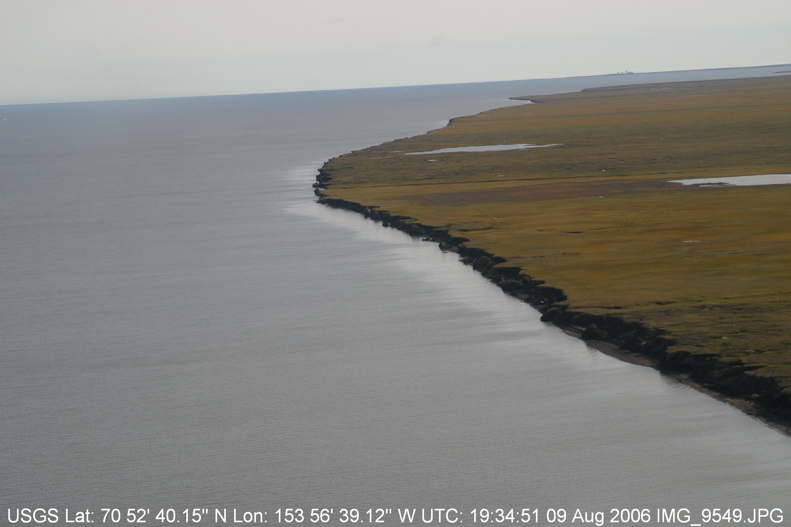
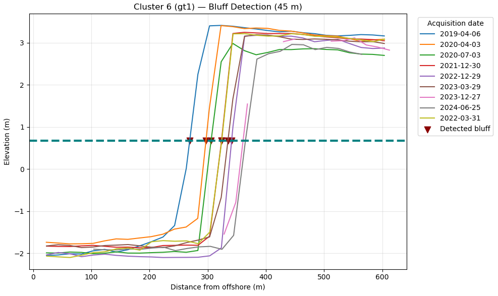
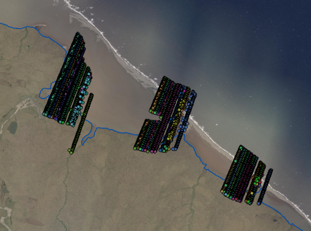
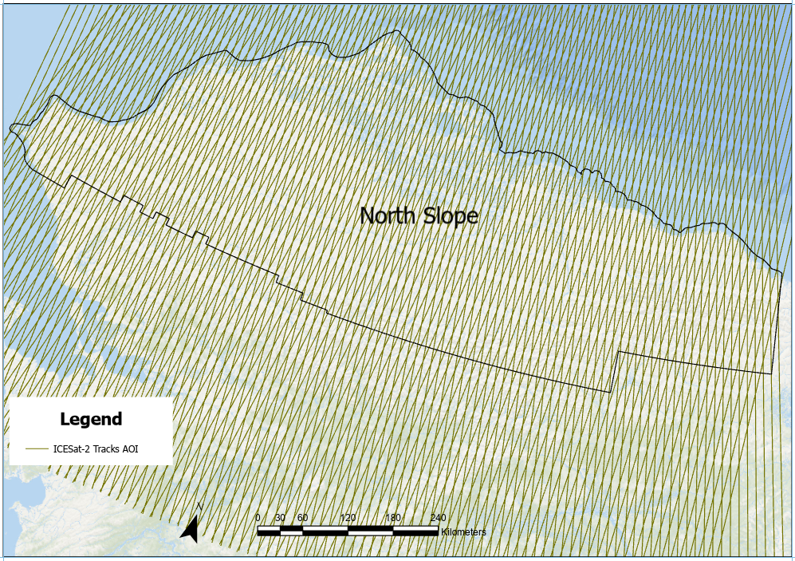
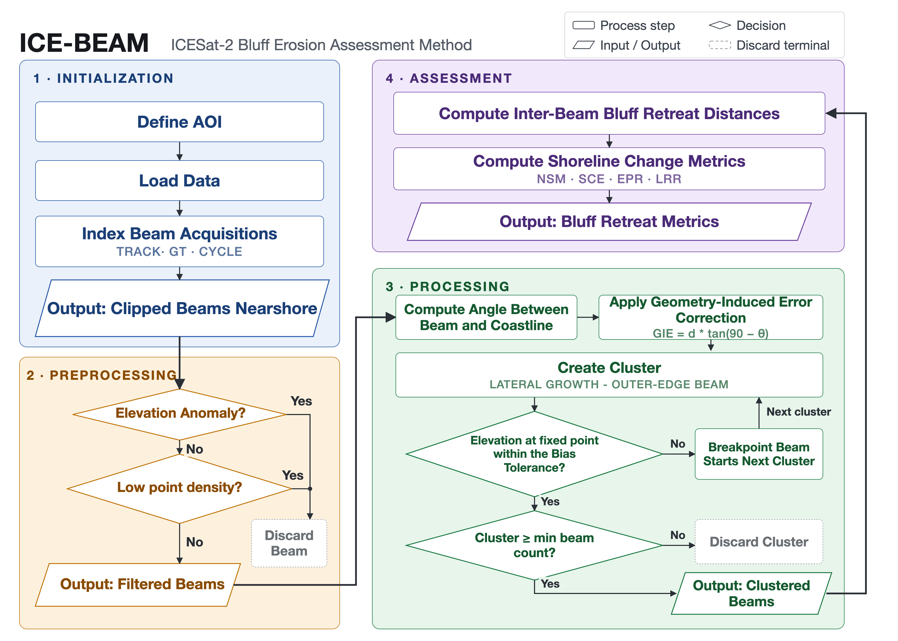

# ICE-BEAM (ICESat-2 Bluff Erosion Assessment Method)
A Python framework to quantify coastal bluff change using ICESat-2 (ATL06) elevation profiles, beam clustering, bias filtering, and DSAS-style shoreline metrics.

<p align="center">
	
</p>

# Purpose
The framework is a modular geospatial workflow that processes and analyzes ICESat-2 elevation data to quantify Arctic coastal retreat. It filters, clusters, and aligns elevation profiles near the shoreline to reduce spatial offset and measurement bias, enabling consistent detection of shoreline change across multiple observation years.

## What it does
- Requests ATL06-like elevation segments from SlideRule at 5 m resolution
- Builds oriented shoreline extraction boxes per ground-track family (gt1/gt2/gt3)
- Clips and aligns elevation profiles (offshore → inland distance)
- Clusters beams near the coast by lateral growth with vertical-bias control
- Estimates bluff positions and computes change metrics (NSM, SCE, EPR, LRR)
- Corrects for oblique beam/coast crossings (GIE correction)

<!-- # Introduction

Importance of permafrost to climate changes…
The impact of the permafrost thaw and erosion…
How hard is to monitor it. The potential of RS …
IS-2 data as an option -->

## Why do this?

ICESat-2 data often contain an offset that causes beams to drift by hundreds of meters, making it impossible to calculate shoreline retreat accurately without post-processing.

## How do we address it?

Our approach aggregates nearby beams to reduce coastal feature mixing and maximize temporal coverage.

## What do we aim to measure?

The main goal is to use reliable, post-processed ICESat-2 data to quantify coastal retreat in the Arctic region.

# Ideal world

Ideally, every cycle of a track passes over the same place on the coast, so we could build profiles like the one below and measure erosion directly.

<p align="center">
	
</p>

In reality, ICESat-2 tracks have a horizontal offset between cycles that makes the data almost unusable as it is (see figure below).

<p align="center">
	
</p>

That is why this framework groups beams into the smallest possible clusters, so that beams over different coastal features, or too far apart, are never compared.

# Input data

The pipeline needs three input layers. The North Slope versions are included in `inputs/` and are already set in `configs/north_slope.toml`:

| File | Layer |
|---|---|
| `inputs/coastline_NSAK_3.shp` | **Coastline** with a `CoastType` field (1 = bluff) |
| `inputs/coastline_NSAK_3Buffer.shp` | **AOI polygon** (buffered coastline) used to limit the SlideRule request |
| `inputs/IS2_tracks.shp` | **ICESat-2 reference ground tracks** (field `Name` = RGT number) |

ICESat-2 elevations are requested from SlideRule per track and cached locally; see `notebooks/00_sliderule_data.ipynb`. Tracks with no data or no bluff-shoreline crossing are skipped.

<p align="center">
	
</p>

# Workflow

<p align="center">
	
</p>

For each ICESat-2 track (RGT):

1.	Load ATL06-like segments from SlideRule (cached per track as GeoPackage)
2.	Build oriented shoreline-crossing boxes per ground-track family (gt1/gt2/gt3)
3.	Compute along-track distance from the box's offshore edge; drop beams with bad elevations or too few points
4.	Build lateral-growth clusters with vertical-bias control and a maximum cluster width
5.	Compute per-beam shoreline crossing angles
6.	Apply the vertical-bias filter
7.	Detect the bluff position in every cycle
8.	Compute DSAS metrics (NSM, SCE, EPR, LRR, ...) for each bias tolerance
9.	Apply the GIE (geometric) correction for oblique beam/coast crossings

# Installation

```bash
conda env create -f environment.yml
conda activate icebeam
pip install -e .
```

# Running

Edit the paths in `configs/north_slope.toml`, then:

```bash
# one track
is2retreat --config configs/north_slope.toml --track 0129

# all tracks in configs/tracks_filtered.txt
./scripts/run_all_tracks.sh
```

Options: `--source cache|sliderule|auto` (default `auto` uses the cached GeoPackage when it exists), `--outdir DIR`, `--set KEY=VALUE` to override a parameter (e.g. `--set SIZE_LIMIT_M=90`).

Results are merged into six CSV tables in the output folder; see [Output tables](#output-tables). Runs are safe in parallel, and re-running a track replaces its rows.

Step-by-step notebooks (each runs on its own; set `TRACK_ID` in the first cell):

| Notebook | Step |
|---|---|
| `notebooks/00_sliderule_data.ipynb` | Download / cache SlideRule beams for a track |
| `notebooks/01_load_and_preprocess.ipynb` | Shoreline, oriented boxes, offshore distance, beam quality |
| `notebooks/02_clusters.ipynb` | Lateral-growth clusters, crossing angles, selection |
| `notebooks/03_bluff_and_gie.ipynb` | Bias filter, bluff detection, DSAS metrics and GIE for one cluster |
| `notebooks/04_run_tracks.ipynb` | All bias tolerances for one or many tracks, output tables |

From Python:

```python
from is2retreat import load_config, run_track
paths, params = load_config("configs/north_slope.toml")
result = run_track("0129", paths, params, write_outputs=False)
result.gie.summary_df
```

# Output tables

Each run writes six CSV tables to the output folder. The suffix is the SlideRule resolution (`_5m`). Tables ending in `_measured` describe bluff positions as detected along each beam; tables ending in `_gie` add the geometric (GIE) correction for beams that cross the coast at an angle.

| Table | One row per | Use it for |
|---|---|---|
| `cluster_metrics_measured_5m.csv` | cluster | Shoreline change rates without correction |
| `cluster_metrics_gie_5m.csv` | cluster | **Main result:** change rates measured and GIE-corrected, side by side |
| `interval_changes_measured_5m.csv` | pair of consecutive dates in a cluster | Change between acquisitions (timelines, seasonal gaps) |
| `interval_changes_gie_5m.csv` | pair of consecutive dates in a cluster | Same, measured and corrected |
| `bluff_positions_gie_5m.csv` | bluff position (one beam on one date) | Checking individual detections and the GIE terms |
| `beam_angles_5m.csv` | beam in a cluster | Beam/shoreline crossing angles |

## Conventions

- **Key columns** in every table: `track_id` (4-digit RGT), `bias_tolerance` (m), `gt_family` (`gt1`/`gt2`/`gt3`), `cluster_id`. Cluster ids are numbered per track *and* bias tolerance, so the same id at two tolerances is not the same cluster.
- **Positions** (`bluff_x`) are distances in meters along the beam from the offshore edge of the extraction box, increasing landward.
- **Sign:** change is first position − last position, so **negative = retreat** (the bluff moved landward) and positive = advance.
- Several detections on the same day are averaged before computing change.
- Dates are UTC acquisition days.

## Cluster metrics (`cluster_metrics_measured`, `cluster_metrics_gie`)

DSAS-style metrics ([USGS DSAS](https://www.usgs.gov/centers/whcmsc/science/digital-shoreline-analysis-system-dsas)). In `cluster_metrics_gie` each metric appears twice, with `_measured` and `_corrected` suffixes; the `_measured` values are normally identical to `cluster_metrics_measured` (they can differ only if a position had no GIE term and was dropped).

| Column | Meaning |
|---|---|
| `NSM` | Net Shoreline Movement (m): first − last position |
| `SCE` | Shoreline Change Envelope (m): max − min position |
| `EPR` | End Point Rate (m/yr): NSM / time span; needs ≥ 365 days |
| `LRR`, `LR2`, `LSE`, `LCI` | Linear Regression Rate (m/yr), its R², standard error (m) and 95 % confidence half-width (m/yr); need ≥ 3 dates over ≥ 365 days |
| `ValidRegression` | True when LRR could be computed |
| `TemporalSpan_days`, `ClusterTemporalSpanYears`, `first_date`, `last_date` | Time covered by the cluster |
| `U_position_m`, `U_NSM_m`, `U_EPR_myr` | Uncertainty: 4.8 m per position, √2 × 4.8 = 6.79 m for NSM, U_NSM / years for EPR |
| `n_beams`, `cluster_width_m` | Member beams, and their lateral spread (m) 500 m from the offshore edge |
| `angle_min_deg` … `angle_mode_deg` | Beam/shoreline crossing angle over member beams (90° = perpendicular) |
| `center_lat`, `center_lon` | Cluster center (WGS84) |
| `elev_avg` | Mean elevation (m) of the kept profiles 500 m from the offshore edge |
| `initial_cycles`, `used_cycles`, `used_cycles_cluster` | Beams in the family after preprocessing, beams used by any cluster, beams used by this cluster |

GIE table only:

| Column | Meaning |
|---|---|
| `reference_beam_id`, `reference_date` | Earliest beam of the cluster; offsets are measured from it |
| `coast_slope_sign` | Orientation of the coast relative to the reference beam (±1), sets the sign of the correction |
| `angle_used_mean_deg`, `angle_used_median_deg` | Angles actually used in the correction |
| `mean_abs_gie`, `max_abs_gie` | Size of the geometric correction (m) |

## Interval changes (`interval_changes_measured`, `interval_changes_gie`)

One row for each pair of consecutive acquisition dates in a cluster (`interval_order` 1, 2, …).

| Column | Meaning |
|---|---|
| `date_from`, `date_to`, `delta_days` | The two dates and the days between them |
| `beam_from`, `beam_to` | Beam(s) observed on each date (separated by a vertical bar when several) |
| `bluff_x_from`, `bluff_x_to` | Positions (m); in the GIE table as `_measured` and `_corrected` |
| `interval_retreat_signed` (measured table), `interval_NSM_measured` / `interval_NSM_corrected` (GIE table) | Change over the interval (m), negative = retreat |
| `direction` / `direction_measured`, `direction_corrected` | `retreat`, `advance` or `stable` |
| `start_days`, `width_days`, `start_retreat`, `width_retreat` | Cumulative days and absolute change, for timeline plots (measured table) |
| `n_obs_from`, `n_obs_to`, `mean_interval_geo` | Detections averaged per date, and change of the GIE term (GIE table) |

The measured table also repeats the cluster's angles, center, dates and metrics (`cluster_NSM`, `cluster_EPR`, …) on every row.

## Bluff positions (`bluff_positions_gie`)

| Column | Meaning |
|---|---|
| `beam_id`, `acq_date` | The observation |
| `bluff_x`, `bluff_y`, `ref_line` | Bluff position (m) where the profile crosses the reference elevation `ref_line` (m) |
| `d_signed`, `d_abs` | Lateral offset from the reference beam (m) |
| `beam_angle_deg`, `angle_used_deg`, `angle_source` | This beam's crossing angle, and whether it (`per_beam`) or the cluster median (`fallback_…`) was used |
| `angle_term`, `NSM_geo` | tan(90° − angle) and the geometric term `coast_slope_sign × d_signed × angle_term` (m) |
| `NSM_measured`, `NSM_corrected` | Change from the reference position, before and after correction (m) |
| `bluff_x_gie` | Corrected position: `bluff_x + NSM_geo` |

## Beam angles (`beam_angles`)

| Column | Meaning |
|---|---|
| `Acq_date`, `beam_id` | The beam |
| `beam_angle` | Angle between the beam and the local shoreline (0–90°) |

# Dashboard

An interactive [Streamlit](https://streamlit.io) dashboard summarizes the data and results in four pages: **Overview** (data availability and maps), **Data Characterization** (beams by region, season, coastal type, crossing angle), **QC / Filtering** (the preprocessing filters), and **Erosion Results** (clusters and EPR by pipeline stage).

```bash
conda activate icebeam
streamlit run dashboard/app.py
```

It opens in the browser at http://localhost:8501. Its data is in `dashboard/data/` (see the README there). The optional historical-DSAS map layer needs a shapefile that is not included in the repository.

# Package layout

| Module | Step |
|---|---|
| `config.py` | `Params` (all parameters and defaults) and `Paths` |
| `inputs.py`, `sliderule_io.py` | UTM zone per track, bluff shoreline, SlideRule request and cache |
| `geometry.py` | Oriented boxes, offshore distances |
| `preprocessing.py` | Beam quality flags |
| `clustering.py`, `angles.py` | Lateral-growth clusters, crossing angles |
| `bias.py`, `bluff.py`, `metrics.py` | Bias filter, bluff detection, DSAS statistics |
| `workflow.py`, `dsas.py` | One bias tolerance / all bias tolerances |
| `gie.py` | GIE correction |
| `outputs.py` | Locked writes to the shared CSV tables |
| `pipeline.py`, `cli.py` | End-to-end per track, command line |
| `diagnostics.py` | Sanity-check tables for interactive use |
