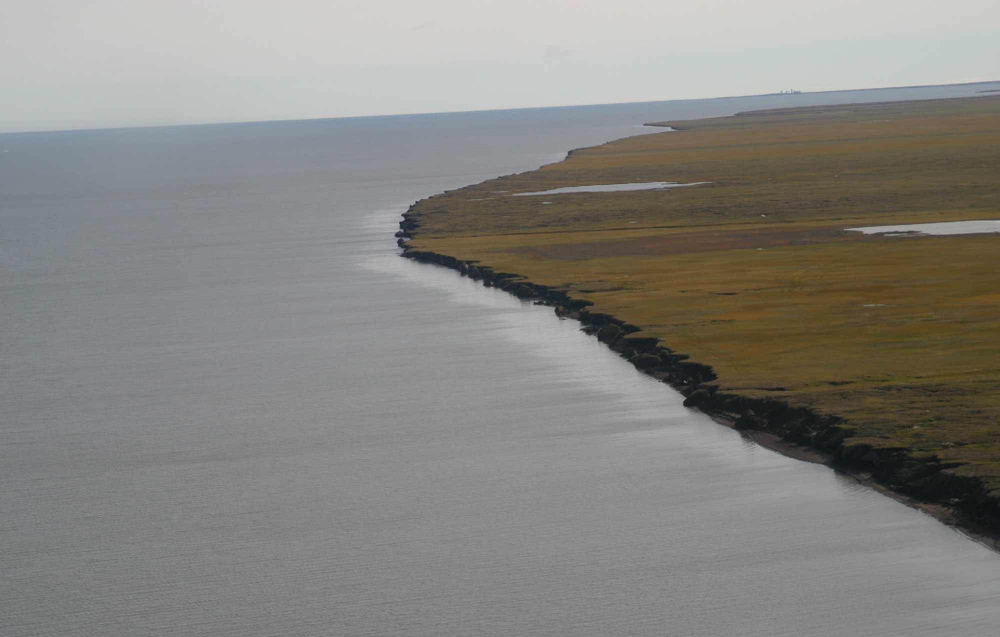

# ICE-BEAM (ICESat-2 Bluff Erosion Assessment Method)
A Python framework to quantify coastal bluff change using ICESat-2 (ATL06) elevation profiles, beam clustering, bias filtering, and DSAS-style shoreline metrics.

<p align="center">
	
</p>

# Purpose
The framework is a modular geospatial workflow that processes and analyzes ICESat-2 elevation data to quantify Arctic coastal retreat. It filters, clusters, and aligns elevation profiles near the shoreline to reduce spatial offset and measurement bias, enabling consistent detection of shoreline change across multiple observation years.

## What it does
- Requests ATL06-like elevation segments from SlideRule at 5 m resolution
- Builds oriented shoreline extraction boxes per ground-track family (gt1/gt2/gt3)
- Clips and aligns elevation profiles (offshore → inland distance)
- Clusters beams near the coast by lateral growth with vertical-bias control
- Estimates bluff positions and computes change metrics (NSM, SCE, EPR, LRR)
- Corrects for oblique beam/coast crossings (GIE correction)

<!-- # Introduction

Importance of permafrost to climate changes…
The impact of the permafrost thaw and erosion…
How hard is to monitor it. The potential of RS …
IS-2 data as an option -->

## Why do this?

ICESat-2 data often contain an offset that causes beams to drift by hundreds of meters, making it impossible to calculate shoreline retreat accurately without post-processing.

## How do we address it?

Our approach aggregates nearby beams to reduce coastal feature mixing and maximize temporal coverage.

## What do we aim to measure?

The main goal is to use reliable, post-processed ICESat-2 data to quantify coastal retreat in the Arctic region.

# Ideal world

Ideally, every cycle of a track passes over the same place on the coast, so we could build profiles like the one below and measure erosion directly.

<p align="center">
	
</p>

In reality, ICESat-2 tracks have a horizontal offset between cycles that makes the data almost unusable as it is (see figure below).

<p align="center">
	
</p>

That is why this framework groups beams into the smallest possible clusters, so that beams over different coastal features, or too far apart, are never compared.

# Input data

The pipeline needs three input layers (paths set in `configs/north_slope.toml`):

- **Coastline** with a `CoastType` field (1 = bluff)
- **AOI polygon** used to limit the SlideRule request
- **ICESat-2 reference ground tracks** (field `Name` = RGT number)

ICESat-2 elevations are requested from SlideRule per track and cached locally; see `notebooks/00_sliderule_data.ipynb`. Tracks with no data or no bluff-shoreline crossing are skipped.

<p align="center">
	
</p>

# Workflow

For each ICESat-2 track (RGT):

1.	Load ATL06-like segments from SlideRule (cached per track as GeoPackage)
2.	Build oriented shoreline-crossing boxes per ground-track family (gt1/gt2/gt3)
3.	Compute along-track distance from the box's offshore edge; drop beams with bad elevations or too few points
4.	Build lateral-growth clusters with vertical-bias control and a maximum cluster width
5.	Compute per-beam shoreline crossing angles
6.	Apply the vertical-bias filter
7.	Detect the bluff position in every cycle
8.	Compute DSAS metrics (NSM, SCE, EPR, LRR, ...) for each bias tolerance
9.	Apply the GIE (geometric) correction for oblique beam/coast crossings

# Installation

```bash
conda env create -f environment.yml
conda activate icebeam
pip install -e .
```

# Running

Edit the paths in `configs/north_slope.toml`, then:

```bash
# one track
is2retreat --config configs/north_slope.toml --track 0129

# all tracks in configs/tracks_filtered.txt
./scripts/run_all_tracks.sh
```

Options: `--source cache|sliderule|auto` (default `auto` uses the cached GeoPackage when it exists), `--outdir DIR`, `--set KEY=VALUE` to override a parameter (e.g. `--set SIZE_LIMIT_M=90`).

Results are merged into six shared CSV tables in the output folder (safe for parallel runs; re-running a track replaces its rows):

| Table | Content |
|---|---|
| `DSAS_5m.csv` | Per-cluster DSAS metrics (measured) |
| `DSAS_Intervals_5m.csv` | Date-to-date bluff change per cluster |
| `DSAS_BeamAngles_5m.csv` | Beam/shoreline angle per beam |
| `DSAS_GIE_AllBiasTol_5m.csv` | Per-cluster metrics, measured and GIE-corrected |
| `DSAS_GIE_AllBiasTol_Intervals_5m.csv` | Date-to-date change, measured and corrected |
| `DSAS_GIE_AllBiasTol_BeamDetails_5m.csv` | Per-observation GIE terms |

Step-by-step notebooks (each runs on its own; set `TRACK_ID` in the first cell):

| Notebook | Step |
|---|---|
| `notebooks/00_sliderule_data.ipynb` | Download / cache SlideRule beams for a track |
| `notebooks/01_load_and_preprocess.ipynb` | Shoreline, oriented boxes, offshore distance, beam quality |
| `notebooks/02_clusters.ipynb` | Lateral-growth clusters, crossing angles, selection |
| `notebooks/03_bluff_and_gie.ipynb` | Bias filter, bluff detection, DSAS metrics and GIE for one cluster |
| `notebooks/04_run_tracks.ipynb` | All bias tolerances for one or many tracks, output tables |

From Python:

```python
from is2retreat import load_config, run_track
paths, params = load_config("configs/north_slope.toml")
result = run_track("0129", paths, params, write_outputs=False)
result.gie.summary_df
```

# Package layout

| Module | Step |
|---|---|
| `config.py` | `Params` (all parameters and defaults) and `Paths` |
| `inputs.py`, `sliderule_io.py` | UTM zone per track, bluff shoreline, SlideRule request and cache |
| `geometry.py` | Oriented boxes, offshore distances |
| `preprocessing.py` | Beam quality flags |
| `clustering.py`, `angles.py` | Lateral-growth clusters, crossing angles |
| `bias.py`, `bluff.py`, `metrics.py` | Bias filter, bluff detection, DSAS statistics |
| `workflow.py`, `dsas.py` | One bias tolerance / all bias tolerances |
| `gie.py` | GIE correction |
| `outputs.py` | Locked writes to the shared CSV tables |
| `pipeline.py`, `cli.py` | End-to-end per track, command line |
| `diagnostics.py` | Sanity-check tables for interactive use |
